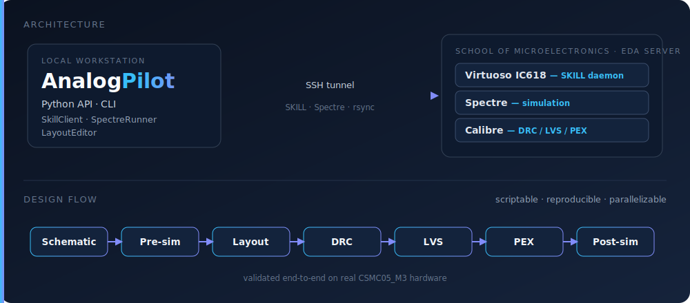

# AnalogPilot

**An AI-agent-driven, scriptable Cadence analog/mixed-signal IC design flow,
tuned for the EDA servers of the School of Microelectronics, South China
University of Technology (SCUT).**

> The Chinese [`README.md`](README.md) and [`docs/`](docs/) are the primary
> documentation. This page is a complete English overview for readers who want
> to understand, install, and evaluate the project.

<p align="center">
  
</p>

<p align="center">
  <a href="LICENSE"></a>
  
  
  
</p>

<p align="center">
  <a href="README.md">Chinese</a> ·
  <a href="docs/00_总览与导航.md">Docs</a> ·
  <a href="AGENTS.md">AGENTS</a> ·
  <a href="examples/full_flow_demo/">Demo</a> ·
  <a href="docs/02_常见问题与排错.md">Troubleshooting</a>
</p>

---

AnalogPilot lets a local workstation drive Cadence Virtuoso, Spectre, and Mentor
Calibre on a remote Linux EDA server through Python and a CLI. It turns the
normally GUI-heavy loop

```text
schematic -> pre-layout simulation -> layout -> DRC/LVS/PEX -> post-layout simulation
```

into a scriptable, reproducible, and batch-friendly workflow.

The project was distilled from a complete 2026 spring analog IC course-design
run at SCUT: an operational amplifier and a bandgap reference were taken from
schematic and pre-simulation through layout, Calibre DRC/LVS/PEX, and Spectre
post-layout simulation. The goal is to preserve the verified engineering
methods, environment conventions, and common failure modes as reusable tools and
documentation.

## Core Capabilities

- **One bridge**: run SKILL in a remote Virtuoso process, run Spectre, call
  Calibre, and transfer files through SSH.
- **Pre-layout automation**: submit Spectre testbenches and parameter sweeps,
  parse PSF ASCII data, and write CSV outputs.
- **Scriptable layout editing**: use `LayoutEditor` to place devices, draw
  routes, drop vias, and add labels. It is not an auto-router; it draws the
  exact geometry you specify.
- **Back-end verification flow**: run Calibre DRC/LVS, two-step PEX, and
  Spectre post-layout simulation with configuration-driven scripts.
- **AI-agent context**: the `skills/` directory provides environment and PDK
  conventions for Claude Code, Cursor, and similar coding agents.
- **Machine-verified examples**: representative flows have been tested end to
  end on the SCUT CSMC05_M3 server environment.

## Architecture

<p align="center">
  
</p>

`apilot` connects your local workstation to three remote tool channels:

- Virtuoso through a SKILL daemon started from the Virtuoso process.
- Spectre through an SSH-submitted standalone netlist runner.
- Calibre through server-side shell scripts and reproducible run directories.

## Scope And Boundaries

AnalogPilot is intended for users who need to work on the SCUT School of
Microelectronics EDA servers and want a scriptable, AI-friendly flow for
analog/mixed-signal IC coursework or research.

The project does **not** include any commercial PDK, technology library, model
file, rule deck, or NDA-controlled process data. All such files are referenced
from the versions installed on the school-managed servers.

AnalogPilot does **not** replace circuit-design judgment. It automates the
mechanical and error-prone parts of the flow so the user can spend more time on
design decisions.

## Documentation Map

Most detailed documents are currently written in Chinese.

| Goal | Document |
|---|---|
| Connect to the server and execute the first SKILL command | [`docs/01_服务器部署指南.md`](docs/01_服务器部署指南.md) |
| Look up common failures by symptom or error message | [`docs/02_常见问题与排错.md`](docs/02_常见问题与排错.md) |
| Understand CSMC05_M3 PDK device and netlist conventions | [`docs/03_CSMC05_PDK备忘.md`](docs/03_CSMC05_PDK备忘.md) |
| Run DRC, LVS, two-step PEX, and post-layout Spectre simulation | [`docs/04_后仿真流程指南.md`](docs/04_后仿真流程指南.md) |
| Measure gain, phase margin, slew rate, and BGR temperature coefficient | [`docs/05_仿真与验证方法学.md`](docs/05_仿真与验证方法学.md) |
| Work with AI agents over long, stateful IC-design iterations | [`docs/06_协作与迭代约定.md`](docs/06_协作与迭代约定.md) |
| Read the full convention index | [`docs/00_总览与导航.md`](docs/00_总览与导航.md) |
| Give coding agents project-level context | [`AGENTS.md`](AGENTS.md) |

## Quick Start

Prerequisites:

- You can log in to the EDA server with `ssh <user>@<host>`.
- A Virtuoso process is already running on the server, started from the VNC
  desktop.
- Local Python is 3.9 or newer.

```bash
# 1) Install locally, preferably in a virtual environment.
git clone https://github.com/GuoJiacheng0402/analog-pilot.git
cd analog-pilot
python3 -m venv .venv
source .venv/bin/activate
pip install -e .

# 2) Write and edit the connection config.
apilot init <user>@<host>       # writes ~/.apilot/.env
$EDITOR ~/.apilot/.env          # fill APILOT_REMOTE_HOST / APILOT_REMOTE_USER

# 3) Configure passwordless SSH once.
ssh-copy-id <user>@<host>

# 4) Start the bridge.
apilot start

# 5) Paste the printed load("...") line into the Virtuoso CIW, then verify.
apilot status                   # expect [tunnel] running / [daemon] OK
apilot selftest                 # checks ssh / tunnel / daemon / SKILL / spectre
```

```python
from apilot import SkillClient

client = SkillClient.from_env()
print(client.execute("1+2"))    # SkillResult(status=SUCCESS, output='3')
```

To auto-load the daemon whenever Virtuoso starts, add the snippet from
[`docs/templates/cdsinit_autoload.il`](docs/templates/cdsinit_autoload.il) to
the server-side `~/.cdsinit`.

## Verified Representative Runs

The following representative results were measured on the SCUT CSMC05_M3 server
environment:

```text
$ apilot selftest
  [ok] ssh reachable      : <server>
  [ok] tunnel             : running
  [ok] daemon             : OK
  [ok] SKILL execute(1+2) : 3
  [ok] spectre channel    : found

$ python examples/full_flow_demo/full_flow_demo.py --lib ANALOG --drc
  1 SKILL        OK
  2 Spectre RC   OK   (-3dB ~ 1.58 MHz)
  3 NMOS I-V     OK   (Id @ Vgs=3V ~ 1267 uA -> CSV)
  4 Layout       OK   (place + route + via)
  5 DRC          OK   (0 hard violations)
```

See [`examples/full_flow_demo/`](examples/full_flow_demo/) for the guided demo.

## Agent Skills

The `skills/` directory contains skill definitions that can be linked into
Claude Code, Cursor, or other coding agents:

```bash
mkdir -p ~/.claude/skills
for s in apilot csmc-pdk postlayout-verify; do
  ln -sf "$(pwd)/skills/$s" ~/.claude/skills/$s
done
```

| Skill | Purpose |
|---|---|
| [`skills/apilot`](skills/apilot/SKILL.md) | Bridge usage: execute SKILL, edit layout with `LayoutEditor`, run Spectre, parse PSF |
| [`skills/csmc-pdk`](skills/csmc-pdk/SKILL.md) | CSMC05_M3 PDK conventions: MOS `fw`, resistor geometry, BJT modeling, phase measurement |
| [`skills/postlayout-verify`](skills/postlayout-verify/SKILL.md) | Post-layout verification: Calibre DRC/LVS/PEX and Spectre post-layout simulation |

## Repository Layout

```text
analog-pilot/
├── README.md / README.en.md / AGENTS.md
├── LICENSE / NOTICE
├── ACADEMIC_USE.md / CONTRIBUTING.md / CHANGELOG.md / CITATION.cff
├── pyproject.toml / .env.example
├── assets/
├── docs/
├── examples/
├── skills/
├── src/apilot/
└── tools/
```

Why are several files kept at the repository root?

- `README.md`, `LICENSE`, `CITATION.cff`, `CONTRIBUTING.md`, and
  `pyproject.toml` are expected at the root by GitHub, citation tooling, or
  Python packaging tools.
- `NOTICE` and `ACADEMIC_USE.md` keep license, attribution, and academic-use
  information easy to find.
- `AGENTS.md` is intentionally root-level so coding agents can discover project
  instructions before editing code.

## Originality And Ownership

AnalogPilot is an independent, self-implemented open-source project. The
project's own source code, documents, and tools do not copy, vendor, or derive
from third-party project code.

The bridge engine in [`src/apilot/`](src/apilot/) is built from scratch on
Cadence Virtuoso's public SKILL IPC mechanism (`ipcBeginProcess` /
`evalstring`). Runtime Python dependencies are declared in
[`pyproject.toml`](pyproject.toml).

See [`NOTICE`](NOTICE) for the full notice.

## Academic Use And Citation

If you use this project in coursework, a thesis, a degree project, a paper, a
technical report, or any derivative work, cite and acknowledge it clearly. The
project is released under GPL-3.0 with a Section 7(b)
attribution-preservation term, and academic work should also follow the
appropriate academic-integrity rules of the relevant course, institution, or
publisher.

Citation information is available in [`CITATION.cff`](CITATION.cff), and a
ready-to-copy acknowledgement is provided in [`ACADEMIC_USE.md`](ACADEMIC_USE.md).

## Author And License

- Author: **GuoJiacheng**, School of Microelectronics, South China University of
  Technology.
- AI-assisted coding and documentation support: **Claude (Anthropic)**.
- License: [GPL-3.0](LICENSE), with a Section 7(b)
  attribution-preservation term.
- Contributions: see [`CONTRIBUTING.md`](CONTRIBUTING.md).
- Changelog: see [`CHANGELOG.md`](CHANGELOG.md).
